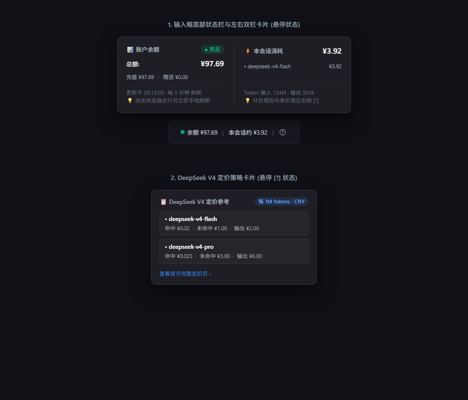

# dsh-balance

DeepSeek 余额实时显示插件: 在 dsh Web UI 输入框**下方、命中率/输入输出 token 统计条所在的同一行**, 实时显示:

- **账户余额与充足度状态指示灯**(如 `🟢 余额 ¥99.47`, 红/黄/绿三色直观反映余额充裕状况)
- **本次对话的估算消耗**(如 `本会话约 ¥0.0007`, 按模型、按 DeepSeek 官方单价估算)
- **`?` 图标**: 悬停显示当前配置的 DeepSeek 定价策略(按模型: 缓存命中/未命中/输出,
  每 1M token), 点击打开官方定价页 <https://api-docs.deepseek.com/zh-cn/quick_start/pricing/>

悬停读数可查看详情: 余额构成(赠送/充值)、余额充足度等级与可用状态、更新时间、刷新间隔、按模型分解的会话消耗与 token 明细。



## 架构

```
┌─────────────┐  按 refreshIntervalMs 轮询   ┌──────────────────┐
│ DeepSeek API│◀────────────────────────────│ 服务器插件(host)  │
│ /user/balance│                            │ · 余额缓存(带陈旧回退)│
└─────────────┘                            │ · /query-balance 路由│
                                           │ · queryBalanceCost  │
                                           │   会话花费投影(按模型)│
                                           └────────┬───────────┘
                                                    │ 只读缓存 / 投影推送帧
                                           ┌────────▼───────────┐
                                           │ 浏览器插件(client)   │
                                           │ · conversation.     │
                                           │   composer.dock 条目 │
                                           │ · 单例轮询器(页面隐藏 │
                                           │   时暂停)            │
                                           └────────────────────┘
```

- **性能**: 浏览器只读本地缓存(每 `clientPollIntervalMs` 一次极小 JSON), 不直接访问 DeepSeek;
  服务器按 `refreshIntervalMs` 拉取并缓存(失败保留上次成功值); 花费由投影折叠计算
  (与 dsh-token-meter 相同的 O(1) 状态机, 同引用事件零开销), 随既有 `session/projection`
  推送帧实时到达客户端, 无额外请求。
- **密钥**: 复用 Harness 的 credentials 能力(`ctx.credentials`), 默认引用
  `DEEPSEEK_API_KEY`(即 `$DSH_HOME/.credentials.yaml` 或进程环境), 无需在配置里写密钥。
- **同行动态布局**: 组件实测统计条兄弟节点的高度, 用负 margin 精确拉回同一行并右对齐;
  统计条不存在(空白会话)时自动退化为独立的一行, 统计条出现后自动归位。

## 安装

### 方式一：使用 DSH CLI 自动安装与配置（推荐）

DeepSeek Harness 自带的插件管理命令可以为您**一键完成下载安装和修改配置文件**：

```sh
dsh plugin --profile web add dsh-balance
```

执行完毕后，**重启 `dsh web` 即可生效。**

### 方式二：让 AI 助手帮您安装

如果您正在使用 Antigravity 等 AI 助手，直接复制以下提示词发给它：

> 请帮我在当前环境中安装 `dsh-balance` 插件，将其配置写入到我的 `cordis.yml` 中并启用它。

### 方式三：本地源码安装

如果您下载了源码，可以通过以下命令进行本地链接安装：

```sh
dsh plugin --profile web add <本目录绝对路径>
```

---

## 升级

当插件发布新版本后，您可以通过以下命令升级到最新版本：

```sh
dsh plugin --profile web remove dsh-balance
pnpm store prune
dsh plugin --profile web add dsh-balance@latest
```

> **为什么需要 `pnpm store prune`？**
> pnpm 会在本地缓存已下载的包。如果不清除缓存，即使 NPM 上已经发布了新版本，
> `dsh plugin add` 仍然可能安装到旧版本。执行 `pnpm store prune` 可以清除过期缓存，
> 确保拉取到最新版本。

---

## 卸载

使用 DSH CLI 一键卸载并自动清理配置文件：

```sh
dsh plugin --profile web remove dsh-balance
```

## 配置模板

在 `$DSH_HOME/profiles/web/cordis.patch.yml`（或指定 profile 的 patch 文件）中覆盖配置。

### 模板 1：标准国内人民币账户（默认开箱即用）

```yaml
- id: dsh-balance
  config:
    apiKey: ''                    # 留空自动复用 DEEPSEEK_API_KEY
    apiKeyRef: DEEPSEEK_API_KEY
    baseUrl: https://api.deepseek.com
    warningThreshold: 10          # 余额 < 10 元显示黄色预警灯
    dangerThreshold: 5            # 余额 < 5 元显示红色告急灯
    refreshIntervalMs: 300000     # 服务器向 DeepSeek 拉取余额的查询间隔(单位: 毫秒 ms，300000ms = 5分钟)
    clientPollIntervalMs: 30000   # 浏览器从本地读取缓存的刷新间隔(单位: 毫秒 ms，30000ms = 30秒)
    timeoutMs: 8000               # 单次网络请求超时时间(单位: 毫秒 ms，8000ms = 8秒)
    currency: CNY
    prices:
      deepseek-chat: { cacheHit: 0.2, cacheMiss: 2, output: 8 }
      deepseek-reasoner: { cacheHit: 0.5, cacheMiss: 4, output: 16 }
    defaultPrices: { cacheHit: 0.2, cacheMiss: 2, output: 8 }
```

### 模板 2：海外美元账户（USD 计价与小额阈值）

```yaml
- id: dsh-balance
  config:
    apiKey: ''
    apiKeyRef: DEEPSEEK_API_KEY
    baseUrl: https://api.deepseek.com
    warningThreshold: 2.0         # 余额 < $2.0 显示黄色预警
    dangerThreshold: 0.5          # 余额 < $0.5 显示红色告急
    refreshIntervalMs: 300000     # 服务器拉取余额间隔(单位: 毫秒 ms，300000ms = 5分钟)
    clientPollIntervalMs: 30000   # 浏览器读取缓存间隔(单位: 毫秒 ms，30000ms = 30秒)
    timeoutMs: 8000               # 请求超时时间(单位: 毫秒 ms，8000ms = 8秒)
    currency: USD                 # 计价货币切换为美元
    prices:
      deepseek-chat: { cacheHit: 0.028, cacheMiss: 0.28, output: 1.10 }
      deepseek-reasoner: { cacheHit: 0.07, cacheMiss: 0.55, output: 2.19 }
    defaultPrices: { cacheHit: 0.028, cacheMiss: 0.28, output: 1.10 }
```

### 模板 3：高频重度开发者（高缓冲安全档）

```yaml
- id: dsh-balance
  config:
    warningThreshold: 50          # 余额 < 50 元预警(留足多次长任务会话缓冲)
    dangerThreshold: 10           # 余额 < 10 元告急
```

### 模板 4：开发测试隔离环境（Dev Profile · 独立 3081 端口）

在 `$DSH_HOME/profiles/dev/cordis.patch.yml` 中：

```yaml
- id: webserver
  config:
    host: 127.0.0.1
    port: 3081                   # 固定测试环境跑在 3081 端口

- id: dsh-balance
  config:
    warningThreshold: 10
    dangerThreshold: 5
```

---

## AI 助手提示词模板 (Prompt Templates)

如果您正在使用 **Antigravity**、**Cursor** 或 **Claude** 等 AI 助手，可直接复制以下提示词发给它自动完成操作：

### 📋 提示词 1：全新安装与默认启用
> 请帮我在当前 DeepSeek Harness 环境中安装 `dsh-balance` 插件，将其默认配置写入到我的 `cordis.patch.yml` 中并确保已启用。

### 📋 提示词 2：调整余额预警与告急阈值
> 请帮我修改 `dsh-balance` 插件的配置，将告急阈值（红灯）设置为 10 元，预警阈值（黄灯）设置为 30 元。

### 📋 提示词 3：切换为美元（USD）账户计价
> 我的 DeepSeek 账户使用的是美元计价，请帮我将 `dsh-balance` 插件的货币单位切换为 `USD`，将阈值调整为预警 $2.0、告急 $0.5，并更新对应的每 1M Token 美元定价策略。

### 📋 提示词 4：配置独立的 Dev 测试环境与端口隔离
> 请帮我初始化一个 DSH `dev` Profile，将本地 `dsh-balance` 插件链接进去，并将 Web 端口固定为 `3081`，以便于我和日常使用的 3080 端口环境并行测试。

---

## 验证

```sh
npm test                         # 运行全部测试
node test/smoke-projection.mjs   # 投影折叠(替换语义/模型归属/计价)测试
node test/smoke-client.mjs       # 客户端 bundle 注册与渲染冒烟测试(零依赖)
```

手工验证:

```sh
curl http://127.0.0.1:3080/query-balance
# → {"ok":true,...,"isAvailable":true,"thresholds":{"warning":10,"danger":5},"balances":[{"currency":"CNY","total":99.74,...}]}
curl http://127.0.0.1:3080/plugins/dsh-balance/client.js   # 客户端 bundle
```

## 开发说明

- 服务器插件: `src/index.js`(ESM, 零构建)。
- 客户端 bundle: `client/client.js`, 手写的惰性 CJS 工厂格式
  (`window.__ModuleLoader__.load({id, factory})`), 修改后**重启 dsh web** 生效
  (无 monorepo 构建链时不做 bundle 重哈希)。
- 项目自带 `node_modules`(schemastery/zod), 与 profile 内同名依赖互不冲突。
- 本地测试: `test/` 目录下提供零依赖单元与冒烟测试，发布 npm 时自动排除测试目录。

## 常见问题 (FAQ)

**Q: 插件怎么知道查询的是哪个用户的余额数据？**

A: 插件在向 DeepSeek 官方服务器发送查询请求时，会在请求头中携带您的 **API Key**（即 `sk-xxxx`）。因为每一个 API Key 在 DeepSeek 官方都是唯一绑定到您的账号上的，所以服务器通过识别这串凭证，就能精准返回您的账号真实余额。
此外，本插件利用了 DSH 原生的凭据管理系统（Credentials），它会自动复用您平时用于聊天的 `DEEPSEEK_API_KEY`，所以您甚至不需要在插件里重复配置密钥，它就“聪明地”复用了您的身份去查余额了！

**Q: 红黄绿状态指示灯的判断规则是什么？**

A:
* 🟢 **绿色（充足）**：余额 $\ge$ `warningThreshold`（默认 $\ge 10$ 元），账户额度充裕。
* 🟡 **黄色（偏低）**：`dangerThreshold` $\le$ 余额 $<$ `warningThreshold`（默认 $5 \sim 10$ 元），提示余量不多，建议适时充值。
* 🔴 **红色（告急）**：余额 $<$ `dangerThreshold`（默认 $< 5$ 元）或余额不可用/异常，警示当前任务可能中断。
各阈值均可在配置文件中自由调节。

